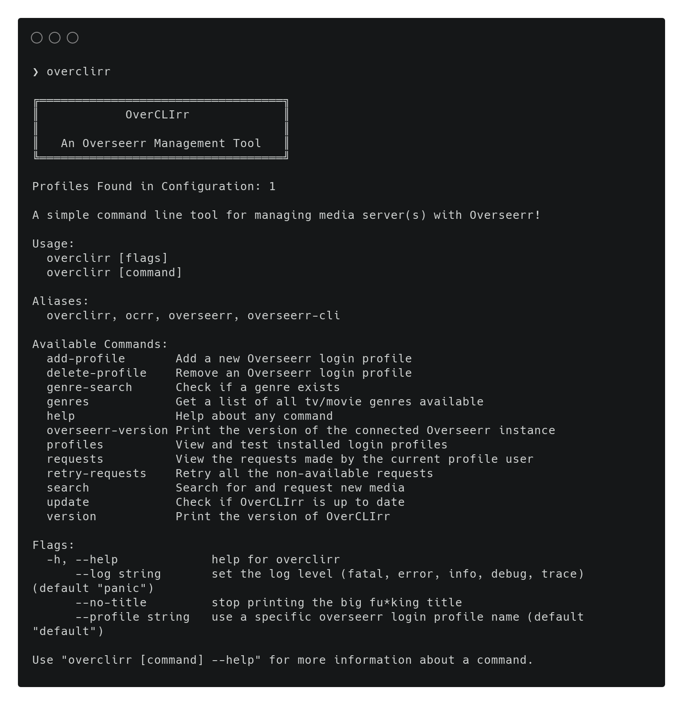

# Overseerr CLI (OverCLIrr)

A command-line client application for interacting with an [Overseerr](https://overseerr.dev) server!

> ⚠️  This is a work in progress

## Features

For Admins:
  - Manage requests
    - View
    - Approve/Decline
    - Delete
    - Retry (resend to sonarr/radarr)
  - Retry all requests
    - Single command to resend all non-available requests to the service

For any user:
  - Search for new tv shows/movies/people
  - Check the Overseerr version
  - Search for/list acceptable genres

## Install

Using `brew` on MacOS:

```bash
brew install willfantom/overclirr/overclirr
```

Download from Github:

  - Download the release for your platform
  - Extract the binary
  - Make the binary executable (e.g. `chmod +x ...`)
  - Copy the binary to a `PATH` dir (e.g. `/bin`)

Build from source:

```bash
go mod download
go build -o overclirr .
```

## Usage

To create your first login profile, just run: `overclirr add-profile`


